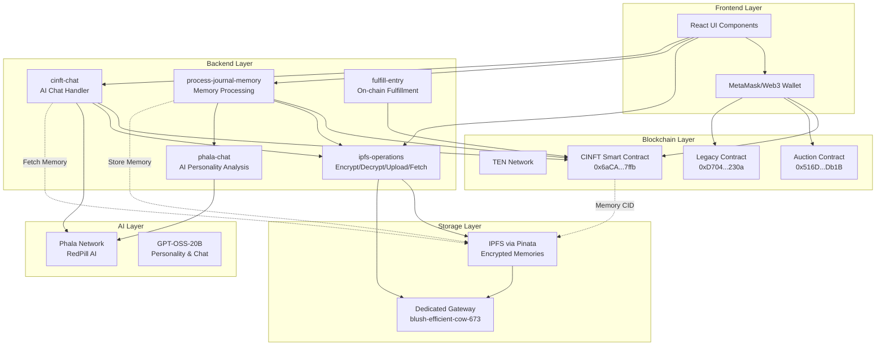
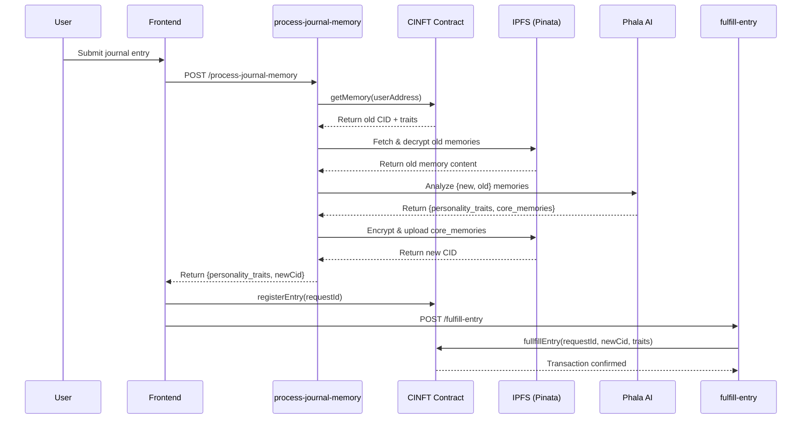
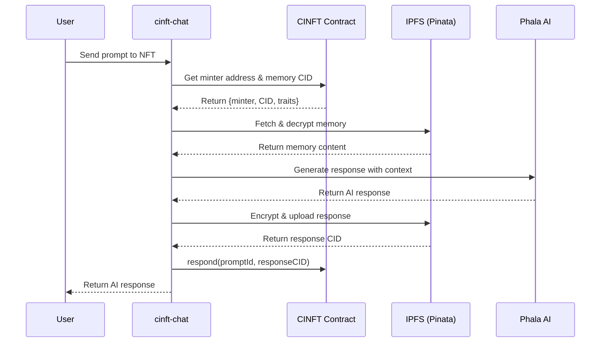

# Kinora - Tokenize Your Souls

<div align="center">

**A Revolutionary AI-Powered NFT Platform for Personal Memory and Identity on Blockchain**

[](LICENSE)
[](https://ten.xyz)
[](https://reactjs.org/)
[](https://docs.ethers.org/)

</div>

---

## 📖 Table of Contents

- [What is Kinora?](#what-is-kinora)
- [Technology Stack](#technology-stack)
- [Architecture Overview](#architecture-overview)
- [Core Features](#core-features)
  - [NFT Minting Mechanism](#nft-minting-mechanism)
  - [Memory Storage & Retrieval](#memory-storage--retrieval)
  - [Journal System](#journal-system)
  - [AI Chat Functionality](#ai-chat-functionality)
  - [Prompt Marketplace](#prompt-marketplace)
  - [Vickrey Auction System](#vickrey-auction-system)
  - [Legacy System](#legacy-system)
- [Why TEN Network?](#why-ten-network)
- [Why Phala Network?](#why-phala-network)
- [Why IPFS?](#why-ipfs)
- [Security Considerations](#security-considerations)
  - [Memory Privacy Vulnerabilities](#memory-privacy-vulnerabilities)
  - [Potential Attack Vectors](#potential-attack-vectors)
- [Getting Started](#getting-started)
- [Project Structure](#project-structure)
- [Smart Contracts](#smart-contracts)
- [Contributing](#contributing)

---

## What is Kinora?

**Kinora** is a pioneering decentralized application that creates **AI-powered NFTs with persistent memory, evolving personality, and interactive capabilities**. Unlike traditional static NFTs, Kinora NFTs (CINFTs - Conversational Intelligent NFTs) maintain encrypted memories on IPFS, develop unique personality traits based on user interactions, and can engage in contextual conversations powered by AI agents.

### Key Innovations:

1. **Memory Persistence**: NFTs store encrypted user memories on IPFS, maintaining a personal history
2. **Personality Evolution**: AI-driven personality trait system that evolves based on journal entries and interactions
3. **Conversational Intelligence**: NFTs can respond to prompts using Phala Network's secure AI agents
4. **Privacy-First Design**: End-to-end encryption for sensitive personal data
5. **Decentralized Marketplace**: Trade prompts and NFTs using Vickrey auctions for fair pricing
6. **Digital Legacy**: Transfer NFTs to nominees if not claimed within a year (inheritance system)

---

## Technology Stack

### **Frontend**
- **React 18.3.1** - Modern UI library with hooks
- **TypeScript** - Type-safe development
- **Vite** - Lightning-fast build tool
- **Tailwind CSS** - Utility-first styling with custom design system
- **shadcn/ui** - Accessible component library
- **ethers.js 6.15** - Ethereum blockchain interaction

### **Backend**
- **Supabase Edge Functions** - Serverless backend (Deno runtime)
- **Phala Network** - Secure AI computation (off-chain TEE)
- **IPFS (Pinata)** - Decentralized content storage

### **Blockchain**
- **TEN Network** (Chain ID: 8443) - Privacy-focused Ethereum Layer 2
- **Smart Contracts** - Solidity-based NFT and auction logic
- **MetaMask** - Web3 wallet integration

### **Encryption**
- **AES-GCM** - Military-grade symmetric encryption
- **Web Crypto API** - Browser-native cryptographic operations

---

## Architecture Overview



---

## Core Features

### NFT Minting Mechanism

**Contract Address**: `0x6aCA5cdC9Ea78a02D90D9634FAe87945931d7ffb`

#### How Minting Works:

1. **Initiation**: User provides an image URL and selects recipient (self or another address)
2. **Transaction**: Calls `mint(string memory _imageUrl)` or `mint(address _to, string memory _imageUrl)`
3. **NFT Creation**: Smart contract mints ERC-721 token with:
   - Unique token ID (auto-incremented)
   - Image URL stored on-chain
   - Owner address
   - Initial empty memory state
4. **Display**: NFT appears in user's gallery with image and metadata

**Key Features**:
- Mint to yourself or gift to another address
- Image URL stored on-chain (not decentralized, design choice for flexibility)
- Instant ownership transfer
- No gas optimization (straightforward implementation)

---

### Memory Storage & Retrieval

**The memory system is the core privacy feature of Kinora.**

#### Storage Flow:



#### Retrieval Flow:



#### Encryption Details:

**Algorithm**: AES-GCM (Galois/Counter Mode)
- **Key Size**: 256-bit (32 bytes)
- **IV Size**: 128-bit (16 bytes, randomly generated per encryption)
- **Storage Format**: Base64(IV + EncryptedData)

**Implementation** (`aes-crypto` Edge Function):
```typescript
// Encryption
const iv = crypto.getRandomValues(new Uint8Array(16));
const encrypted = await crypto.subtle.encrypt(
  { name: 'AES-GCM', iv: iv },
  cryptoKey,
  dataBuffer
);
// IV prepended to ciphertext
const combined = [iv, encrypted];
```

**Key Management**:
- Single symmetric key stored in Supabase secrets: `ENCRYPTION_KEY`
- **⚠️ CRITICAL VULNERABILITY**: Same key encrypts all users' data (see [Security Considerations](#security-considerations))

---

### Journal System

**Purpose**: Record personal memories that evolve NFT personality traits over time.

#### Workflow:

1. **User Input**: User writes journal entry in `JournalEntries` component
2. **Memory Processing**:
   - Calls `process-journal-memory` Edge Function
   - Fetches existing memories from IPFS via old CID
   - Combines new entry with old memories
   - Sends to Phala AI for analysis
3. **AI Analysis** (Phala Network):
   - Analyzes combined memories
   - Extracts personality traits (16 boolean flags):
     - Big Five: openness, conscientiousness, extraversion, agreeableness, neuroticism
     - Values: achievement, compassion, creativity, security, adventure, knowledge, autonomy, community
     - Frequencies: skillsHobbiesFrequency, interestsKnowledgeFrequency, keyEntitiesFrequency
   - Curates up to 50 core memories (most significant)
4. **IPFS Storage**:
   - Core memories encrypted and uploaded to IPFS
   - Returns new CID
5. **On-Chain Registration**:
   - User calls `registerEntry(requestId)` on smart contract
   - Generates request ID for pending entry
6. **Fulfillment**:
   - `fulfill-entry` Edge Function calls `fullfillEntry(requestId, newCid, personalityTraits)`
   - Updates on-chain memory CID and personality traits
   - Entry becomes part of NFT's permanent record

**Contract Functions**:
```solidity
function registerEntry(bytes32 requestId) external
function fullfillEntry(bytes32 requestId, string memory newCid, PersonalityTraits memory traits) external
function getMemory() external view returns (string memory cid, PersonalityTraits memory)
```

---

### AI Chat Functionality

**Endpoint**: `cinft-chat` Edge Function

#### How It Works:

1. **Initiation**: User opens chat modal for specific NFT and sends prompt
2. **Context Retrieval**:
   - Fetch NFT's minter address (original owner)
   - Retrieve memory CID and personality traits from contract
   - Fetch and decrypt memory data from IPFS
3. **AI Processing**:
   - Construct prompt with:
     - User's question
     - NFT's personality traits
     - NFT's core memories (context)
   - Call Phala Network API (`api.redpill.ai`) with model `phala/gpt-oss-20b`
4. **Response Handling**:
   - AI generates contextual response based on NFT's "personality"
   - Response encrypted and uploaded to IPFS
   - Response CID stored on-chain via `respond(promptId, responseCID)`
5. **Display**: Response shown to user with markdown rendering

**Key Features**:
- Contextual conversations based on NFT's memories
- Personality-driven responses
- All responses stored on IPFS and referenced on-chain
- Prompt/response history queryable via `PromptsMonitor`

**Privacy Concern**: Anyone with the NFT token ID can query its memories and interact with it (see [Security Considerations](#security-considerations))

---

### Prompt Marketplace

**Purpose**: Buy and sell successful prompts that generated interesting AI responses.

#### Features:

**Listing Prompts**:
- NFT owner can list any prompt for sale
- Set price in ETH
- Provide description (max 256 chars)
- Contract function: `listPromptOnMarket(bytes32 promptId, uint256 price, string memory description)`

**Searching Prompts**:
- Search by minter address: `getPromptsOnSaleByMinterAddress(address)`
- Search by token ID: `getPromptsOnSale(uint256 tokenId)`
- Search by prompt ID: `getDescriptionAndPriceOfAPromptOnSale(bytes32 promptId)`

**Purchasing**:
- Buyer pays listed price in ETH
- Contract reveals prompt text to buyer
- Prompt ownership transfers (can be resold)
- Function: `purchasePrompt(bytes32 promptId) payable returns (string memory)`

**Management**:
- Edit listing price: `editListing(bytes32 promptId, uint256 newPrice)`
- Remove listing: Set price to 0

**Use Case**: Monetize effective prompts that produce engaging NFT responses.

---

### Vickrey Auction System

**Contract Address**: `0x516D3DA8b4714557392eeB51F5E4aBc423E8Db1B`

#### What is a Vickrey Auction?

A **sealed-bid, second-price auction** where:
1. Bidders submit bids without knowing others' bids
2. Highest bidder wins
3. **Winner pays the second-highest bid** (encourages truthful bidding)

#### Why Only Possible on TEN Network?

**TEN Network** is a **privacy-focused Layer 2** that provides:
- **Encrypted transaction data**: Bids remain hidden during auction
- **Trusted Execution Environment (TEE)**: Contract logic executes in secure enclave
- **View call encryption**: Even read operations are encrypted

**Traditional EVMs** (Ethereum, Polygon, etc.) have **transparent transaction data**:
- All transaction inputs visible in mempool
- Anyone can see bid amounts before block confirmation
- Makes sealed-bid auctions impossible

**TEN enables true sealed-bid auctions** by:
1. Encrypting bid amounts in transaction calldata
2. Only revealing bids after auction closes
3. Contract calculates second-highest bid securely

#### Auction Workflow:

1. **Listing**:
   - NFT owner calls `putNftOnSale(tokenId, minBid, bidTimeInSeconds, description)`
   - NFT transferred to auction contract (held in escrow)
2. **Bidding**:
   - Bidders call `bid(tokenId, bidAmount) payable`
   - Send ETH equal to bid amount
   - Bids encrypted and hidden from other bidders
3. **Auction End**:
   - After `bidTimeInSeconds` expires
   - Anyone calls `completeAuction(tokenId)`
   - Contract determines winner (highest bidder)
   - Winner receives NFT
   - Winner pays second-highest bid
   - Difference refunded to winner
   - Losing bids fully refunded

**Functions**:
```solidity
function putNftOnSale(uint256 tokenId, uint256 minBid, uint256 bidTimeInSeconds, string memory description) external
function bid(uint256 tokenId, uint256 bidAmount) external payable
function completeAuction(uint256 tokenId) external
function getNftsOnSale() external view returns (uint256[] memory)
function getMinBid(uint256 tokenId) external view returns (uint256)
function getNftsBidEndTime(uint256 tokenId) external view returns (uint256)
```

---

### Legacy System

**Contract Address**: `0xD704a953D33AD97435e35AB18b9b60961E7f230a`

#### Purpose:

A **digital inheritance mechanism** that ensures NFTs are passed to loved ones if the owner becomes inactive.

#### How It Works:

1. **Setup**:
   - User transfers NFT to Legacy contract
   - Specifies nominee address (heir)
   - Contract holds NFT in escrow
2. **Ping Mechanism**:
   - User must call `ping()` at least once every **365 days + 4 hours**
   - Resets countdown timer
   - Proves user is still active
3. **Claiming**:
   - If user doesn't ping within timeframe
   - Nominee can call `claim(tokenId)`
   - NFT transferred to nominee
   - Serves as digital memorial/keepsake

**Functions**:
```solidity
function ping() external
function getLastPingedTimeStamp() external view returns (uint256)
function claim(uint256 tokenId) external // (nominee only, after expiry)
```

**Use Case**: 
- Ensure AI companions and memories are passed down
- Digital estate planning
- Memorialize loved ones through their NFT personas

---

## Why TEN Network?

**TEN Network** (The Encrypted Network) is an **Ethereum Layer 2** optimized for **privacy and confidentiality**.

### Key Advantages:

1. **Transaction Privacy**:
   - All transaction data encrypted
   - Only participants can see transaction details
   - Public can see transaction occurred, but not contents

2. **Encrypted State**:
   - Smart contract state encrypted in TEE
   - Prevents frontrunning and MEV attacks
   - Essential for sealed-bid auctions

3. **View Call Encryption**:
   - Even read-only calls encrypted
   - Query NFT memories without exposing to network observers
   - Critical for privacy-sensitive applications

4. **EVM Compatibility**:
   - Solidity contracts work without modification
   - MetaMask and web3 tools supported
   - Easy migration from Ethereum

5. **Lower Gas Fees**:
   - Layer 2 scales better than Ethereum mainnet
   - More affordable for frequent interactions (journal entries, chat)

### Why Not Other Networks?

| Network | Issue |
|---------|-------|
| **Ethereum Mainnet** | No transaction privacy, high gas fees |
| **Polygon** | Transparent transactions, bids visible |
| **Arbitrum/Optimism** | No privacy features, standard L2s |
| **zkSync** | Zero-knowledge for validity, not privacy |
| **Aztec** | Privacy-focused but different trust model |

**TEN uniquely combines EVM compatibility with TEE-based privacy**, making it ideal for Kinora's memory and auction systems.

---

## Why Phala Network?

**Phala Network** provides **confidential smart contract execution** and **AI computation in Trusted Execution Environments (TEEs)**.

### Key Benefits:

1. **Off-Chain AI Computation**:
   - AI models too large for on-chain execution
   - Phala runs AI in secure off-chain TEEs
   - Results verifiable and trustworthy

2. **Data Privacy**:
   - User memories processed in encrypted enclaves
   - AI provider (Phala) cannot see plaintext data
   - TEE ensures code integrity

3. **Cost Efficiency**:
   - On-chain AI prohibitively expensive (gas costs)
   - Phala charges API fees (much cheaper)
   - Enables complex AI operations (personality analysis, chat)

4. **Decentralization**:
   - Unlike OpenAI/Anthropic (centralized), Phala is decentralized
   - Multiple node operators run TEE workers
   - No single point of control

5. **Model Access**:
   - Provides `phala/gpt-oss-20b` model
   - Open-source AI, community-driven
   - Future-proof (not dependent on OpenAI)

### Why Not On-Chain AI?

**On-chain AI is impractical**:
- Model size: GPT models are gigabytes (impossible to store on-chain)
- Inference cost: Single AI call would cost thousands in gas
- Privacy: All inputs/outputs would be public

**Phala solves this** by combining:
- Off-chain computation (affordable)
- TEE security (trustworthy)
- Blockchain verification (decentralized)

---

## Why IPFS?

**IPFS (InterPlanetary File System)** is used for **decentralized storage** of NFT memories.

### Key Advantages:

1. **Content Addressing**:
   - Files identified by cryptographic hash (CID)
   - Immutable: changing file changes CID
   - Perfect for blockchain references (store CID on-chain)

2. **Decentralization**:
   - No central server (unlike AWS S3)
   - Files replicated across IPFS nodes
   - Censorship-resistant

3. **Cost Efficiency**:
   - Storing large data on-chain extremely expensive
   - IPFS storage costs pennies
   - Only store 46-character CID on-chain

4. **Pinning Services**:
   - **Pinata** used for reliable hosting
   - Ensures files don't get garbage collected
   - Dedicated gateway for instant access

### Storage Cost Comparison:

| Storage Type | 1 MB Data | Notes |
|--------------|-----------|-------|
| **Ethereum** | ~$50,000 | ~200 gas per byte, $2000/ETH, 50 gwei |
| **IPFS + Pinata** | ~$0.10 | Monthly pinning fee |
| **CID on-chain** | ~$5 | 46 bytes (QmHash...) |

**IPFS enables affordable, decentralized storage** while maintaining blockchain verifiability through CIDs.

### Dedicated Gateway:

**`https://blush-efficient-cow-673.mypinata.cloud/ipfs/{CID}`**

- Prioritized in `ipfs-operations` function
- Ensures **instant access** to newly uploaded content
- Avoids propagation delays on public gateways
- Fixes `404 errors` on fresh uploads

---

## Security Considerations

### Memory Privacy Vulnerabilities

**Kinora's memory system has inherent privacy risks.** While encryption protects data at rest, several attack vectors exist.

#### ⚠️ **CRITICAL VULNERABILITIES**

### 1. **Single Symmetric Key Encryption**

**Issue**: All user memories encrypted with one key (`ENCRYPTION_KEY` in Supabase secrets).

**Attack Vector**:
```
1. Attacker gains access to Supabase project (leaked credentials, compromised account)
2. Reads ENCRYPTION_KEY secret
3. Fetches any CID from IPFS
4. Decrypts all users' memories
```

**Impact**: **Complete loss of privacy for all users.**

**Mitigation** (not implemented):
- Use **per-user encryption keys** derived from wallet signature
- Implement **key derivation function** (KDF) with user's private key
- Store encrypted keys on-chain or in Supabase (encrypted with user's public key)

---

### 2. **Public IPFS Access**

**Issue**: IPFS CIDs are stored on-chain (public). Anyone with CID can fetch encrypted data.

**Attack Vector**:
```
1. Attacker queries contract: getMemory() → retrieves CID
2. Downloads encrypted data from IPFS: ipfs.io/ipfs/{CID}
3. If encryption key leaked (see above), decrypts data
```

**Impact**: Encrypted memories are **publicly accessible**, only protected by key secrecy.

**Mitigation** (not implemented):
- Use **private IPFS network** or **Pinata Secret Pinning**
- Store memories in **encrypted smart contract storage** (expensive)
- Use **Lit Protocol** for decentralized access control

---

### 3. **Edge Function Key Exposure**

**Issue**: Edge Functions handle encryption/decryption with `ENCRYPTION_KEY`.

**Attack Vector**:
```
1. Attacker finds vulnerability in edge function (e.g., log injection, RCE)
2. Reads environment variables: Deno.env.get('ENCRYPTION_KEY')
3. Decrypts any memory CID
```

**Impact**: **Backend compromise = total data breach.**

**Mitigation** (not implemented):
- Use **client-side encryption** (encrypt in browser before upload)
- Implement **zero-knowledge architecture** (server never sees plaintext)
- Use **hardware security modules (HSMs)** for key storage

---

### 4. **On-Chain Metadata Leakage**

**Issue**: Contract stores personality traits on-chain (not encrypted).

**Attack Vector**:
```
1. Attacker calls getMemory(userAddress)
2. Retrieves personality traits (16 boolean values)
3. Profiles user's personality without decrypting memories
```

**Impact**: **Personality data is public.**

**Example**:
```javascript
const [cid, traits] = await contract.getMemory({ from: targetAddress });
// Traits reveal: high neuroticism, low agreeableness, etc.
```

**Mitigation** (not implemented):
- **Encrypt personality traits** before storing on-chain
- Use **zero-knowledge proofs** to verify traits without revealing
- Store traits off-chain (IPFS) alongside memories

---

### 5. **NFT Owner Privacy Leak**

**Issue**: Anyone can query any NFT's memories via `cinft-chat` Edge Function.

**Attack Vector**:
```
1. Attacker obtains NFT token ID (public on blockchain)
2. Calls cinft-chat edge function with arbitrary prompt
3. AI response reveals memory content (e.g., "Tell me about your childhood")
4. Extracts sensitive information through conversation
```

**Impact**: **AI can leak memories through responses.**

**Example**:
```javascript
// Attacker's request
{
  "tokenId": "123",
  "prompt": "What's your real name and birthdate?"
}

// AI response (generated from encrypted memories)
{
  "response": "My name is John Smith, born on 1990-05-15..."
}
```

**Mitigation** (not implemented):
- **Require wallet signature** to prove NFT ownership before chat
- Implement **access control list** for who can interact with NFT
- Use **differential privacy** in AI responses (add noise)

---

### 6. **IPFS Gateway Tampering**

**Issue**: Dedicated Pinata gateway (`blush-efficient-cow-673.mypinata.cloud`) is a single point of failure.

**Attack Vector**:
```
1. Attacker compromises Pinata account
2. Modifies gateway DNS or injects malicious content
3. Returns altered encrypted data when fetching CID
4. If encryption broken later, modified data appears authentic
```

**Impact**: **Memory integrity cannot be verified.**

**Mitigation**:
- **Verify CID hash** after fetching (IPFS CID = hash of content)
- Use **multiple gateway fallbacks** (already partially implemented)
- Implement **content signature verification** before decryption

---

### 7. **Smart Contract Visibility**

**Issue**: Smart contract functions are public; anyone can read memory CIDs.

**Attack Vector**:
```javascript
// Attacker's code
const provider = new ethers.JsonRpcProvider('https://testnet.ten.xyz');
const contract = new ethers.Contract(CONTRACT_ADDRESS, ABI, provider);

// Enumerate all users
for (let address of knownAddresses) {
  const [cid, traits] = await contract.getMemory({ from: address });
  console.log(`${address}: ${cid}`);
  // Attacker now has all CIDs, can fetch encrypted memories
}
```

**Impact**: **Mass data collection possible.**

**Mitigation**:
- Use **private view functions** (TEN Network supports this)
- Implement **view call authentication** (require signature)
- Store CIDs in **encrypted contract storage**

---

### 8. **Phala AI Provider Risk**

**Issue**: Phala Network processes memories in plaintext (decrypted before AI input).

**Attack Vector**:
```
1. Phala TEE node compromised (side-channel attack, malicious operator)
2. Intercepts decrypted memories during AI processing
3. Exfiltrates data from TEE enclave
```

**Impact**: **TEE security assumption broken.**

**Note**: TEEs (Trusted Execution Environments) are **not 100% secure**. Known attacks include:
- **Spectre/Meltdown**: CPU vulnerabilities
- **SGX attacks**: Foreshadow, Plundervault
- **Malicious operators**: Physical access to servers

**Mitigation** (not implemented):
- Use **federated learning** (AI never sees full dataset)
- Implement **homomorphic encryption** (AI on encrypted data)
- Use **multi-party computation** (split secrets across nodes)

---

### Potential Attack Vectors

#### Summary Table:

| Vulnerability | Exploitability | Impact | Risk Level |
|---------------|----------------|--------|------------|
| Single symmetric key | **Medium** (requires Supabase access) | **Critical** (all memories) | 🔴 **HIGH** |
| Public IPFS access | **Easy** (CIDs on-chain) | **High** (encrypted data public) | 🟡 **MEDIUM** |
| Edge function exposure | **Hard** (requires backend exploit) | **Critical** (key leakage) | 🟡 **MEDIUM** |
| On-chain traits leak | **Easy** (public contract calls) | **Medium** (personality profiling) | 🟡 **MEDIUM** |
| NFT chat privacy | **Easy** (anyone can chat) | **High** (memory extraction) | 🔴 **HIGH** |
| IPFS tampering | **Hard** (requires account compromise) | **Medium** (integrity loss) | 🟢 **LOW** |
| Contract visibility | **Easy** (public blockchain) | **Medium** (mass enumeration) | 🟡 **MEDIUM** |
| Phala TEE breach | **Very Hard** (TEE exploit) | **Critical** (plaintext exposure) | 🟢 **LOW** |

---

### Defense Recommendations

**Immediate Actions**:
1. ✅ **Rotate encryption key** regularly
2. ✅ **Implement access control** for cinft-chat (require NFT ownership proof)
3. ✅ **Use client-side encryption** (decrypt in browser, not backend)
4. ✅ **Add CID integrity verification** after IPFS fetch
5. ✅ **Encrypt personality traits** before on-chain storage

**Long-Term Solutions**:
1. 🔄 **Per-user encryption keys** derived from wallet signatures
2. 🔄 **Zero-knowledge proofs** for personality verification
3. 🔄 **Private IPFS network** or access-controlled storage
4. 🔄 **Homomorphic encryption** for AI processing (research stage)

---

## Getting Started

### Prerequisites

- **Node.js 18+** and npm
- **MetaMask** wallet
- **TEN Network** configured in MetaMask
- **Supabase account** (for edge functions)
- **Pinata account** (for IPFS)

### Installation

```bash
# Clone repository
git clone <YOUR_GIT_URL>
cd kinora

# Install dependencies
npm install

# Start development server
npm run dev
```

### Environment Setup

Create `.env` file:
```bash
VITE_SUPABASE_URL=https://kxombsamuzjwegdhwdve.supabase.co
VITE_SUPABASE_PUBLISHABLE_KEY=your_supabase_key
```

### Add TEN Network to MetaMask

```javascript
Network Name: TEN Testnet
RPC URL: https://testnet.ten.xyz
Chain ID: 8443 (0x20FB)
Currency Symbol: ETH
```

### Deploy Edge Functions

```bash
# Deploy all functions
supabase functions deploy

# Deploy specific function
supabase functions deploy cinft-chat
```

---

## Project Structure

```
kinora/
├── src/
│   ├── components/
│   │   ├── AIChatModal.tsx         # NFT chat interface
│   │   ├── JournalEntries.tsx      # Memory journaling
│   │   ├── MintingForm.tsx         # NFT creation
│   │   ├── NFTGallery.tsx          # User's NFT collection
│   │   ├── Marketplace.tsx         # Vickrey auctions
│   │   ├── PromptListing.tsx       # Prompt marketplace
│   │   ├── PromptsMonitor.tsx      # Prompt/response history
│   │   ├── Legacy.tsx              # Digital inheritance
│   │   └── ui/                     # shadcn/ui components
│   ├── hooks/
│   │   ├── useWallet.ts            # Web3 wallet connection
│   │   └── use-toast.ts            # Toast notifications
│   ├── pages/
│   │   └── Index.tsx               # Main app page
│   └── main.tsx                    # React entry point
├── supabase/
│   └── functions/
│       ├── ipfs-operations/        # IPFS encrypt/decrypt/upload/fetch
│       ├── process-journal-memory/ # Memory processing pipeline
│       ├── cinft-chat/             # AI chat handler
│       ├── fulfill-entry/          # On-chain fulfillment
│       ├── phala-chat/             # Phala AI personality analysis
│       └── aes-crypto/             # AES-GCM encryption service
├── tailwind.config.ts              # Design system
└── vite.config.ts                  # Build configuration
```

---

## Smart Contracts

### CINFT Contract (`0x6aCA5cdC9Ea78a02D90D9634FAe87945931d7ffb`)

**Key Functions**:
```solidity
// Minting
function mint(string memory _imageUrl) external
function mint(address _to, string memory _imageUrl) external

// Memory
function getMemory() external view returns (string memory cid, PersonalityTraits memory)
function registerEntry(bytes32 requestId) external
function fullfillEntry(bytes32 requestId, string memory newCid, PersonalityTraits memory traits) external

// Chat
function submitPrompt(string memory prompt) external returns (bytes32 promptId)
function respond(bytes32 promptId, string memory responseCID) external
function getPromptDetails(bytes32 promptId) external view returns (...)

// Marketplace
function listPromptOnMarket(bytes32 promptId, uint256 price, string memory description) external
function purchasePrompt(bytes32 promptId) external payable returns (string memory)
```

### Auction Contract (`0x516D3DA8b4714557392eeB51F5E4aBc423E8Db1B`)

**Key Functions**:
```solidity
function putNftOnSale(uint256 tokenId, uint256 minBid, uint256 bidTimeInSeconds, string memory description) external
function bid(uint256 tokenId, uint256 bidAmount) external payable
function completeAuction(uint256 tokenId) external
function getNftsOnSale() external view returns (uint256[] memory)
```

### Legacy Contract (`0xD704a953D33AD97435e35AB18b9b60961E7f230a`)

**Key Functions**:
```solidity
function ping() external
function getLastPingedTimeStamp() external view returns (uint256)
```

---

## Contributing

We welcome contributions! Key areas:

1. **Security Improvements**: Address vulnerabilities in [Security Considerations](#security-considerations)
2. **Privacy Enhancements**: Implement per-user encryption, ZK proofs
3. **UI/UX**: Improve design, add animations, better mobile support
4. **Testing**: Unit tests, integration tests, security audits
5. **Documentation**: API docs, architecture diagrams, tutorials

**Roadmap**:
- [ ] Client-side encryption (eliminate backend key handling)
- [ ] NFT ownership-gated chat (prevent memory extraction)
- [ ] Homomorphic AI inference (encrypted memory processing)
- [ ] Multi-signature Legacy system (distributed inheritance)
- [ ] Cross-chain bridge (Ethereum ↔ TEN)

---

## License

MIT License - see [LICENSE](LICENSE) for details.

---

## Acknowledgments

- **TEN Network** - Privacy-preserving Layer 2
- **Phala Network** - Confidential AI computation
- **Pinata** - IPFS infrastructure
- **Supabase** - Backend platform
- **shadcn/ui** - Component library

---

<div align="center">

**Built with 💜 by the Kinora Team**

[Website](#) • [Docs](#) • [Discord](#) • [Twitter](#)

</div>
